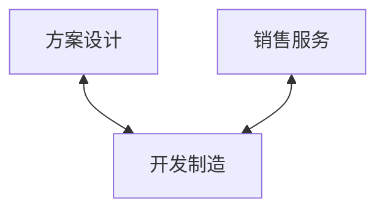

---
{"dg-publish":true,"permalink":"/【观点】（部分）政府信息化项目的本质是否只是为了实现投资？/","tags":["观点","信息化"]}
---

核心观点：有一些政府类的信息化项目，其本质是否是政府投资的一种形式？

讨论点：
1. 对于这类信息化项目，政府目标是什么？
2. 对于这类信息化项目，企业中标靠什么？
3. 对于这类信息化项目，未来出路是什么？
4. 对于这类信息化项目，产品团队怎么办？

文章思路：

# 面向政府的信息化项目现状概述

## 定义

什么是信息化项目？
什么是政府信息化项目？
面向政府的信息化项目有什么特点？

## 国内情况 VS 国外情况

总体来讲：
- 国内的面向政府信息化项目比较多。
- 国外的面向政府信息化项目比较少。

## 目前现状的原因分析

引出本文的核心观点：

`中国的政府信息化项目，本质来讲是拉动中国经济增长的“三驾马车”中“投资”的一部分。`

# 中国政府信息化项目中标靠什么？

一句话：以各种“智慧”系统为例，这些政府信息化项目的中标，主要靠商务关系，也就是销售。

微笑曲线：

一般的微笑曲线，方案、设计和销售、服务是处于价值较高的两端，而制造处于价值较低的中间。

放在政府信息化项目领域：
- 解决方案是很关键的，因为要靠解决方案向用户证明理解了需求，能解决实际问题；
- 销售是更关键的，因为这里的核心壁垒并不高，也就是说对于业务的理解虽然重要，但是并不是独一份的，别人也能对于业务进行理解。但是在项目决策过程对主要干系人关键影响，却是整个项目的关键。而接触到这个主要干系人的人，一般都是销售。
- 实施人员是不关键的，原因有以下：
	- 目前的政府信息化项目主要还是处于比较初级的阶段，也就是实现一些基于业务的数据增删改查，并没有太多高深的功能，只不过里面的业务逻辑需要梳理与实现；
	- 政府信息化项目中，也存在比较棘手的需求，但是这些需求的难度又超过了一般的软件研发工程师的能力，需要科班人员自己写算法、代码等实现；

# 这类信息化项目目前处境与未来出路

近期特点
1. 政府信息化项目，会随着政府财政紧张的加剧，数量和单价大幅度减少。
2. 剩余的政府信息化项目，会越来越“干”，一方面要建立的是刚需系统，另一方面越来越要实效。

但是，决定厂家是否能够拿到项目的，仍然是：关系 > 方案 > 实施。

# 产品团队在这个情况下怎么办？

如果你是产品团队，总体思路很明确：远离中间（交付），靠近两端（方案、销售）。

在《纳瓦尔宝典》中，纳瓦尔将一个人的核心能力归纳为了“构建”和“销售”。那么，通俗来讲也就是：做出来和卖出去。对于一个产品团队也是如此。

里面还讲到了，一个人成功的核心是：把自己产品化。
- 自己——找到自己独特的个人价值；
- 产品化——能够低成本重复交付，复利化；

产品团队也应该这样要求自己。

